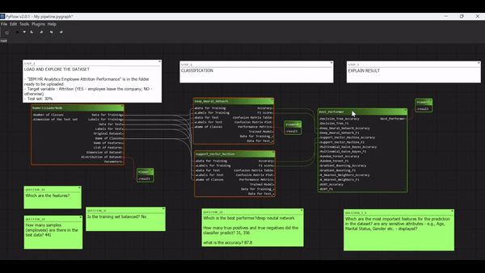

**PyFlowML**, currently in its early development stage as of May 2024, is a prototype developed within PyFlow's open-source, flow-based environment. **PyFlow**, a Python Qt visual scripting framework, is designed to facilitate GUI creation through visual programming, allowing non-technical users in computing to construct applications by dragging and dropping components onto a graphical canvas. Core elements of PyFlow include **nodes** (for operations and functions), **pins** (as connection ports), and **arcs** (to transmit data).

Expanding upon the PyFlow framework, PyFlowML introduces **machine learning (ML)** analysis through four types of nodes: Data Load, Data Visualization, Data Classification, and Explainable AI (XAI). This integration emphasizes XAI techniques to clarify and demystify the decision-making processes in ML-based systems, thus enhancing understanding, trust, and trustworthiness among users.

Thus far, PyFlowML has been employed in research to investigate how Visual Programming Languages (VPLs) and no-code platforms can foster user participation in designing ML-based systems.

## Author

[Serena Versino](https://github.com/serenav10)

## License
For more information on the licensing of PyFlowML and the conditions under which it is provided, please see the [license](LICENSE) file in this repository.

